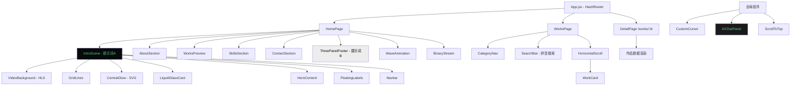

# 前端重写方案 - 融合入场场景与设计规范

> [!important] 核心目标
> 对 Etta 个人作品集网站进行彻底的前端重写：使用 React + Vite + Tailwind CSS 技术栈，将提示词A的入场场景与提示词B的设计规范深度融合到原项目的全部内容与功能中，实现形式与功能的完整统一。

## 一、概述

### 1.1 项目背景

当前项目是一个基于原生 HTML/CSS/JavaScript 的个人作品集网站，包含：
- 主页（index.html）：开场动画 + 关于我 + 作品预览 + 技能 + 合作咨询 + AI对话
- 作品总览页（works.html）：分类导航 + 横向滚动卡片 + 搜索系统
- 22个作品详情页（detail/*.html）
- 7个独立交互项目（program/*.html）：6个小游戏 + QQ音乐仿写
- AI对话系统（DeepSeek API 流式响应）

### 1.2 重写目标

1. **入场场景融合**：用提示词A的视觉设计（HLS视频背景、液态玻璃卡片、网格线、中央光晕）替换原包豪斯风格开场动画，场景完成后**不可消失**，保留为页面 Hero 区域，并从中悬浮出导航锚点标签
2. **设计规范融入**：将提示词B的设计语言（DM Sans/Inter字体、wordReveal逐词揭示动画、3面板底部布局、配色方案、组件模式）有机融入全部页面与组件
3. **内容保真**：原网站的18个作品、6个游戏、AI对话、搜索系统、联系表单等**全部内容与功能不缺失**
4. **技术升级**：从原生JS迁移至 React + Vite，组件化架构，保持 GitHub Pages 部署兼容

### 1.3 关键决策

| 决策项 | 选择 | 理由 |
|--------|------|------|
| 技术栈 | React 18 + Vite 5 + Tailwind CSS 3 | 组件复用、生态成熟、Vite 构建快 |
| 路由方案 | HashRouter | GitHub Pages 兼容，无需服务器配置 |
| 游戏处理 | 保留为独立HTML，放入 `public/program/` | 避免重写复杂游戏逻辑的风险 |
| 详情页 | 统一动态路由 `/works/:id` | 22页共用模板，数据驱动渲染 |
| 动画方案 | CSS Keyframes + IntersectionObserver | 轻量无依赖，性能好 |
| 构建路径 | `base: './'` 相对路径 | GitHub Pages 子路径兼容 |
| 部署 | GitHub Actions + Pages Secrets | 保持现有 CI/CD 流程 |

---

## 二、当前状态分析

### 2.1 文件清单（原始）

> [!note] 完整文件清单
> 以下为项目中所有需要迁移或处理的文件，重写时将逐一对应。

#### 核心页面文件

| # | 文件路径 | 用途 | 行数 | 处理方式 |
|---|----------|------|------|----------|
| 1 | `index.html` | 主页入口 | ~600 | → `src/pages/HomePage.jsx` |
| 2 | `works.html` | 作品总览页 | ~1100(含内联JS) | → `src/pages/WorksPage.jsx` |
| 3 | `detail/template.html` | 详情页模板 | ~200 | → `src/pages/DetailPage.jsx` |
| 4-25 | `detail/*.html` (22个) | 各作品详情页 | ~200-300/页 | → 数据驱动，内容迁移至 `worksData.js` |

#### JavaScript 文件

| # | 文件路径 | 用途 | 行数 | 处理方式 |
|---|----------|------|------|----------|
| 26 | `script.js` | 主页核心逻辑 | 1184 | 拆分为多个 React 组件/hooks |
| 27 | `works-data.js` | 作品数据+渲染函数 | 351 | → `src/data/worksData.js` |
| 28 | `ai-engine.js` | AI对话引擎 | 397 | → `src/lib/aiEngine.js` |
| 29 | `ai-prompt.js` | AI系统提示词 | 50 | → `src/data/aiPrompt.js` |
| 30 | `ai-config.js` | DeepSeek API配置 | 7 | → `src/config/aiConfig.js` (gitignored) |
| 31 | `cursor.js` | 自定义光标 | 49 | → `src/components/CustomCursor.jsx` |
| 32 | `server.js` | Node.js静态服务器 | 68 | 移除（Vite dev server 替代） |
| 33 | `js/dynamicEffects.js` | 空文件 | 0 | 移除 |

#### CSS 文件

| # | 文件路径 | 用途 | 行数 | 处理方式 |
|---|----------|------|------|----------|
| 34 | `style.css` | 全局主样式 | 3627 | → Tailwind classes + `src/index.css` |
| 35 | `works-preview.css` | 作品预览卡片样式 | 166 | → Tailwind classes |
| 36 | `cursor.css` | 自定义光标样式 | 59 | → `src/components/CustomCursor.css` |
| 37 | `ai-chat.css` | AI对话面板样式 | 490 | → `src/components/AIChat.css` |

#### 静态资源

| # | 目录/文件 | 内容 | 处理方式 |
|---|-----------|------|----------|
| 38 | `img/` (25个文件) | 主站图片 | → `public/img/` |
| 39 | `font/` | 字体+iconfont | → `public/font/` |
| 40 | `video/` (2个文件) | 视频文件 | → `public/video/` |
| 41 | `art/` (4个文件) | 艺术作品原图 | → `public/art/` |
| 42 | `AIGC/` | AIGC素材 | → `public/AIGC/` |
| 43 | `favicon.png` | 网站图标 | → `public/favicon.png` |

#### 独立交互项目（保留为独立HTML）

| # | 文件路径 | 用途 | 处理方式 |
|---|----------|------|----------|
| 44 | `program/snake.html` | 贪吃蛇 | → `public/program/snake.html` |
| 45 | `program/gobang.html` | 五子棋 | → `public/program/gobang.html` |
| 46 | `program/minesweeper.html` | 扫雷 | → `public/program/minesweeper.html` |
| 47 | `program/spider-solitaire.html` | 蜘蛛纸牌 | → `public/program/spider-solitaire.html` |
| 48 | `program/threeKills.html` | 跳一跳 | → `public/program/threeKills.html` |
| 49 | `program/contra.html` | 魂斗罗 | → `public/program/contra.html` |
| 50 | `program/qq-music.html` | QQ音乐仿写 | → `public/program/qq-music.html` |
| 51 | `program/style.css` | program共用样式 | → `public/program/style.css` |
| 52 | `program/font/` | program字体 | → `public/program/font/` |
| 53 | `program/img/` | QQ音乐图片 | → `public/program/img/` |
| 54 | `program/imgs/` | 游戏图片 | → `public/program/imgs/` |
| 55 | `program/favicon.ico` | program图标 | → `public/program/favicon.ico` |
| 56 | `modeling/sikadi/` | 斯卡蒂建模工程 | → `public/modeling/sikadi/` |

#### 配置与部署

| # | 文件路径 | 用途 | 处理方式 |
|---|----------|------|----------|
| 57 | `.github/workflows/deploy.yml` | GitHub Pages部署 | 更新为Vite构建流程 |
| 58 | `.gitignore` | Git忽略规则 | 更新（添加node_modules等） |
| 59 | `README.md` | 项目说明 | 更新 |

### 2.2 原始功能清单

> [!abstract] 必须保留的全部功能
> 以下功能在重写后必须 100% 保留，不可遗漏。

**主页功能：**
1. 开场动画（替换为提示词A场景）
2. Perlin噪声波浪SVG动画 + 鼠标交互
3. 鼠标跟随球
4. 二进制流横条滚动
5. 导航栏滚动文字轮播（6条状态）
6. 关于我（中文自我介绍）
7. 代表作品4分类预览卡片（2x2网格）
8. 核心技能4条进度条（动画+数字计数）
9. 合作咨询表单（姓名/邮箱/需求 + mailto提交）
10. 微信二维码弹窗（三矩形飞入动画）
11. 返回顶部按钮
12. 平滑锚点滚动
13. IntersectionObserver元素入场动画
14. 视差滚动效果
15. 导航栏滚动变化
16. 自定义鼠标光标

**作品总览页功能：**
17. 左侧分类导航（含子分类展开）
18. 横向滚动卡片（鼠标滚轮+拖拽+箭头）
19. 滚动进度指示器
20. 搜索系统（拼音/首字母模糊搜索 + 标签筛选 + 搜索历史 + 高亮匹配 + 空结果建议）
21. Anime.js入场动画 → CSS animation替代
22. 分类切换动画
23. 卡片点击跳转（详情页或外部链接）
24. 占位卡片（"即将上线"）

**详情页功能：**
25. 统一模板（返回导航 + Hero + 内容区）
26. 入场动画

**AI对话功能：**
27. 悬浮球（脉冲动画）
28. 对话面板（头部 + 欢迎区 + 消息区 + 输入区）
29. 4个建议问题
30. DeepSeek API流式SSE响应
31. localStorage消息持久化
32. 清除对话确认
33. Etta人物设定系统提示词
34. 彩蛋代码"6923"（Laser身份解锁）

**独立交互项目：**
35-41. 6个小游戏 + QQ音乐仿写（保留为独立HTML链接）

---

## 三、设计融合策略

### 3.1 提示词A应用：入场场景

> [!tip] 融合原则
> 提示词A的**视觉设计**完整保留，**内容**适配为 Etta 个人作品集品牌。场景作为页面 Hero 区域，**不消失**，导航锚点从中悬浮而出。

#### 视觉元素迁移

| 提示词A元素 | 原始内容 | → Etta 适配内容 |
|-------------|----------|-----------------|
| HLS视频背景 | Mux流 `tLkHO1qZoaaQOUeVWo8hEBeGQfySP02EPS02BmnNFyXys.m3u8` | 保持不变 |
| 视频透明度 | 60% | 保持不变 |
| 左侧暗色渐变 | #070b0a → transparent | 保持不变 |
| 底部渐变 | 向上渐变增强可读性 | 保持不变 |
| 垂直网格线 | 25%/50%/75% 处，white/10 | 保持不变 |
| 中央SVG光晕 | 椭圆，青色/深绿色调，25px高斯模糊 | 保持不变 |
| 液态玻璃卡片 | 200x200px，translate-y-[-50px] | 保持视觉规格，内容改为作品集标签 |
| Eyebrow文字 | "Career-Ready Curriculum" #5ed29c | → "Creative Developer" #5ed29c |
| 主标题 | "LAUNCH YOUR CODING CAREER." | → "CREATIVE DEVELOPER." (绿色句号) |
| 描述文字 | "Master in-demand coding skills..." | → "平面设计 · 视频剪辑 · 三维建模 · 前端开发" |
| CTA按钮 | "Get Started" + ArrowRight | → "Explore Works" + ArrowRight |
| 导航Logo | "CodeNest" | → "Etta" (白色极简) |
| 导航链接 | PROJECTS, BLOG, ABOUT, RESUME | → ABOUT, WORKS, SKILLS, CONTACT |
| 移动端菜单 | 汉堡菜单全屏暗色覆盖 | 保持不变 |

#### 液态玻璃卡片内容适配

```
[ 2025 ]                          ← 年份标签 14px
Multidisciplinary Creator         ← 18px，Instrument Serif italic 用于 "Creator"
探索18+作品 · 6款小游戏 · AI对话   ← 11px 描述
```

#### 悬浮标签系统

> [!info] 场景完成后，以下标签从场景中悬浮而出
> 标签使用提示词B的 wordReveal 动画逐个出现，与场景共存。

1. **导航锚点标签**：About / Works / Skills / Contact（从液态玻璃卡片周围浮出）
2. **引导链接标签**：
   - "查看全部作品 →"（链接到 /works）
   - "联系合作 →"（滚动到联系区域）
   - "AI对话 →"（触发AI面板）
3. **滚动指示器**：底部居中，带动画提示向下滚动

### 3.2 提示词B深度融入：设计语言

> [!tip] 融合原则
> 深入理解提示词B每个设计元素的理念，以**自然合理**的方式融入，非生搬硬套。产出统一设计语言。

#### 字体系统

| 字体 | 用途 | 来源 |
|------|------|------|
| **DM Sans** (400, 500) | 品牌名、导航链接、大标题、面板1文字 | 提示词B |
| **Inter** (400, 500, 800) | 按钮、正文、面板2/3文字、主标题(ExtraBold) | 提示词A+B |
| **Instrument Serif** (italic) | 特殊强调文字（如"Industry"、"Creator"） | 提示词A |
| **Plus Jakarta Sans** (bold) | Eyebrow文字 | 提示词A |

Google Fonts 引入：
```html
<link href="https://fonts.googleapis.com/css2?family=DM+Sans:wght@400;500&family=Inter:wght@400;500;800&family=Instrument+Serif:ital@1&family=Plus+Jakarta+Sans:wght@700&display=swap" rel="stylesheet">
```

#### 配色方案

```css
:root {
  /* 暗色基底 (提示词A) */
  --color-bg-dark: #070b0a;
  --color-accent: #5ed29c;        /* 绿色强调色 */

  /* 面板色 (提示词B) */
  --color-panel-1: #ECEDEC;       /* 浅灰面板 */
  --color-panel-2: #FEFDF9;       /* 暖白面板 */
  --color-panel-3: #000000;       /* 纯黑面板 */

  /* 文字层级 */
  --color-text-primary: #ffffff;
  --color-text-secondary: rgba(255,255,255,0.9);
  --color-text-muted: rgba(255,255,255,0.6);
  --color-text-dimmed: rgba(255,255,255,0.45);
  --color-text-dark: #070b0a;
  --color-text-dark-muted: rgba(0,0,0,0.8);

  /* 边框/网格 */
  --color-border-subtle: rgba(255,255,255,0.1);
  --color-border-dark: rgba(0,0,0,0.2);
}
```

#### 动画系统

> [!example] CSS Keyframe 动画定义
> 全部使用 `cubic-bezier(0.16, 1, 0.3, 1)` 缓动，`both` 填充模式。

| 动画类 | 关键帧 | 时长 | 用途 |
|--------|--------|------|------|
| `.animate-word-reveal > span` | translateY(100%)+blur(4px) → translateY(0)+blur(0) | 0.7s | 标题逐词揭示 |
| `.animate-fade-up` | opacity:0 + translateY(30px) → visible | 0.8s | 元素上浮淡入 |
| `.animate-fade-in` | opacity:0 → 1 | 0.7s | 简单淡入 |
| `.animate-slide-left` | opacity:0 + translateX(-40px) → visible | 0.8s | 左滑入 |
| `.animate-slide-right` | opacity:0 + translateX(40px) → visible | 0.8s | 右滑入 |
| `.animate-scale-in` | opacity:0 + scale(0.9) → visible | 1s | 缩放进入 |

延迟类：`.delay-200` 到 `.delay-1200`（0.1s 递增）

#### 3面板底部布局（适配 Etta 作品集）

> [!note] 原提示词B为 TerraElix 品牌设计，适配为 Etta 作品集内容

**Panel 1** (`bg-[#ECEDEC]`)：
- 文字："开启你的创意视觉之旅" (DM Sans 400, 响应式 28-35px)
- 链接："查看作品集" (下划线, Inter 400)
- 装饰图片：`img/Etta.png` 或相关艺术图片 (右侧绝对定位, mix-blend-multiply)

**Panel 2** (`bg-[#FEFDF9]`) — 自动轮播卡片：
1. Code图标, 黑色圆圈: "涵盖平面设计、视频剪辑、三维建模三大领域"
2. Gamepad图标, 绿色圆圈(#5ed29c): "6款原生HTML/CSS/JS小游戏，浏览器即玩"
3. Sparkles图标, 青色圆圈: "AIGC风格化短片与叙事短片创作"
4. MessageCircle图标, 琥珀色圆圈: "AI数字声音 Etta，随时为你解答"

轮播间隔 3500ms，淡入/滑动过渡，底部4条进度指示条

**Panel 3** (`bg-black`)：
- 左侧：作品图片 `img/以手造物.png` (响应式 120-208px宽)
- 右侧："+18" (Inter 400, 响应式 24-35px) + "件创意作品已在此展示" (text-white/60)

### 3.3 统一设计语言总结

```
字体：DM Sans (标题/品牌) + Inter (正文/按钮) + Instrument Serif (强调)
配色：#070b0a 暗底 + #5ed29c 绿色强调 + #ECEDEC/#FEFDF9/#000 面板色
动画：wordReveal逐词 + fadeUp淡入上浮 + scaleIn缩放
圆角：rounded-full (按钮) + rounded-md (卡片)
玻璃效果：backdrop-blur + rgba低透明背景
缓动：cubic-bezier(0.16, 1, 0.3, 1)
```

---

## 四、技术架构

### 4.1 技术栈

| 类别 | 技术 | 版本 |
|------|------|------|
| 框架 | React | 18.x |
| 构建工具 | Vite | 5.x |
| CSS框架 | Tailwind CSS | 3.x |
| 路由 | React Router (HashRouter) | 6.x |
| 视频流 | hls.js | 1.x |
| 图标 | lucide-react | latest |
| 拼音搜索 | pinyin-pro | 3.x |
| 部署 | GitHub Pages + Actions | — |

### 4.2 项目结构

```
0-Personal Portfolio/
├── public/                         # 静态资源（原样复制到dist）
│   ├── img/                        # 主站图片 (25个文件)
│   ├── font/                       # 字体+iconfont
│   ├── video/                      # 视频文件
│   ├── art/                        # 艺术作品原图
│   ├── AIGC/                       # AIGC素材
│   ├── modeling/                   # 建模工程文件
│   ├── program/                    # 6游戏+QQ音乐 (独立HTML)
│   │   ├── snake.html
│   │   ├── gobang.html
│   │   ├── minesweeper.html
│   │   ├── spider-solitaire.html
│   │   ├── threeKills.html
│   │   ├── contra.html
│   │   ├── qq-music.html
│   │   ├── style.css
│   │   ├── font/
│   │   ├── img/
│   │   ├── imgs/
│   │   └── favicon.ico
│   └── favicon.png
├── src/
│   ├── main.jsx                    # 应用入口
│   ├── App.jsx                     # 根组件 + 路由
│   ├── index.css                   # 全局样式 + Tailwind指令 + CSS变量
│   ├── animations.css              # CSS Keyframe动画 (提示词B)
│   ├── config/
│   │   └── siteConfig.js           # 站点配置（品牌名、链接、邮箱等）
│   ├── data/
│   │   ├── worksData.js            # 作品数据 (迁移自works-data.js)
│   │   └── aiPrompt.js             # AI系统提示词 (迁移自ai-prompt.js)
│   ├── hooks/
│   │   ├── useInView.js            # IntersectionObserver 入场动画hook
│   │   ├── useCountUp.js           # 数字计数动画hook
│   │   ├── useLocalStorage.js      # localStorage hook
│   │   └── useMediaQuery.js        # 响应式断点hook
│   ├── lib/
│   │   ├── aiEngine.js             # AI引擎 (迁移自ai-engine.js)
│   │   └── pinyinSearch.js         # 拼音搜索工具
│   ├── components/
│   │   ├── intro/                  # 提示词A - 入场场景
│   │   │   ├── IntroScene.jsx      # 入场场景容器 (整合所有子组件)
│   │   │   ├── VideoBackground.jsx # HLS视频背景
│   │   │   ├── GridLines.jsx       # 垂直网格线
│   │   │   ├── CentralGlow.jsx     # SVG中央光晕
│   │   │   ├── LiquidGlassCard.jsx # 液态玻璃卡片
│   │   │   ├── HeroContent.jsx     # 英雄区文字内容
│   │   │   ├── FloatingLabels.jsx  # 悬浮导航标签
│   │   │   └── IntroScene.css      # 液态玻璃/网格等专属样式
│   │   ├── layout/
│   │   │   ├── Navbar.jsx          # 导航栏 (logo + 链接 + 移动端菜单)
│   │   │   ├── Navbar.css          # 导航栏专属样式
│   │   │   ├── CustomCursor.jsx    # 自定义鼠标光标
│   │   │   ├── CustomCursor.css    # 光标样式
│   │   │   ├── ScrollToTop.jsx     # 返回顶部按钮
│   │   │   └── FrameBorder.jsx     # 框架边框 (可选保留)
│   │   ├── sections/
│   │   │   ├── AboutSection.jsx    # 关于我
│   │   │   ├── WorksPreview.jsx    # 代表作品4分类预览
│   │   │   ├── SkillsSection.jsx   # 核心技能进度条
│   │   │   ├── ContactSection.jsx  # 合作咨询表单
│   │   │   └── QRCodePopup.jsx     # 微信二维码弹窗
│   │   ├── works/
│   │   │   ├── CategoryNav.jsx     # 左侧分类导航
│   │   │   ├── WorkCard.jsx        # 作品卡片
│   │   │   ├── HorizontalScroll.jsx # 横向滚动容器
│   │   │   ├── SearchBar.jsx       # 搜索栏 (拼音+标签+历史)
│   │   │   └── ThreePanelFooter.jsx # 3面板底部布局
│   │   ├── ai/
│   │   │   ├── AIChatPanel.jsx     # AI对话面板
│   │   │   ├── AIChatPanel.css     # 对话面板样式
│   │   │   └── ChatMessage.jsx     # 消息气泡组件
│   │   └── effects/
│   │       ├── WaveAnimation.jsx   # Perlin噪声波浪SVG
│   │       └── BinaryStream.jsx    # 二进制流滚动条
│   ├── pages/
│   │   ├── HomePage.jsx            # 主页 (入场场景 + 各模块)
│   │   ├── WorksPage.jsx           # 作品总览页
│   │   └── DetailPage.jsx          # 作品详情页 (动态路由)
│   └── assets/                     # React组件内引用的小型资源
├── index.html                      # Vite入口HTML
├── package.json
├── vite.config.js
├── tailwind.config.js
├── postcss.config.js
├── .gitignore
├── .github/
│   └── workflows/
│       └── deploy.yml              # 更新后的部署工作流
└── README.md
```

### 4.3 组件架构图



### 4.4 路由设计

| 路径 | 组件 | 说明 |
|------|------|------|
| `#/` | HomePage | 主页：入场场景 + 关于/作品/技能/联系 |
| `#/works` | WorksPage | 作品总览：分类导航 + 搜索 + 卡片 |
| `#/works/:id` | DetailPage | 作品详情：动态路由，数据驱动 |
| `#/program/*.html` | (直接链接) | 游戏/QQ音乐：独立HTML，新窗口打开 |

---

## 五、详细实施计划

### 阶段1：项目初始化与配置

**任务：**
1. 在项目根目录初始化 Vite + React 项目
2. 安装依赖：`react`, `react-dom`, `react-router-dom`, `hls.js`, `lucide-react`, `pinyin-pro`
3. 安装开发依赖：`tailwindcss`, `postcss`, `autoprefixer`, `@vitejs/plugin-react`
4. 配置 `vite.config.js`（`base: './'`, React 插件）
5. 配置 `tailwind.config.js`（自定义颜色、字体、动画）
6. 配置 `postcss.config.js`
7. 创建 `index.html`（Vite入口，引入Google Fonts）
8. 更新 `.gitignore`（添加 `node_modules/`, `dist/`, `src/config/aiConfig.js`）
9. 创建 `src/main.jsx` 和 `src/App.jsx` 基础结构

**Tailwind 配置要点：**
```js
// tailwind.config.js
export default {
  content: ['./index.html', './src/**/*.{js,jsx}'],
  theme: {
    extend: {
      colors: {
        'bg-dark': '#070b0a',
        'accent': '#5ed29c',
        'panel-1': '#ECEDEC',
        'panel-2': '#FEFDF9',
        'panel-3': '#000000',
      },
      fontFamily: {
        'sans': ['Inter', 'system-ui', 'sans-serif'],
        'display': ['DM Sans', 'sans-serif'],
        'serif': ['Instrument Serif', 'serif'],
        'eyebrow': ['Plus Jakarta Sans', 'sans-serif'],
      },
    },
  },
}
```

**验证：** `npm run dev` 能启动开发服务器，页面显示空白 React 应用。

---

### 阶段2：设计系统搭建

**任务：**
1. 创建 `src/index.css`：
   - Tailwind 指令（@tailwind base/components/utilities）
   - CSS 自定义属性（颜色变量）
   - 全局基础样式（body, scroll-behavior, selection等）
   - Google Fonts 引入
2. 创建 `src/animations.css`：
   - 全部6组 Keyframe 动画（wordReveal, fadeUp, fadeIn, slideInLeft, slideInRight, scaleIn）
   - 动画类（.animate-word-reveal 等）
   - 延迟类（.delay-200 到 .delay-1200）
   - 统一缓动 `cubic-bezier(0.16, 1, 0.3, 1)`
3. 创建 `src/hooks/useInView.js`：
   - IntersectionObserver 封装
   - 返回 `[ref, isInView]`
   - 支持阈值、只触发一次
4. 创建 `src/hooks/useCountUp.js`：
   - 数字计数动画（requestAnimationFrame）
   - 支持目标值、时长、缓动函数
5. 创建 `src/hooks/useLocalStorage.js`：
   - localStorage 读写封装
   - JSON 序列化/反序列化
6. 创建 `src/hooks/useMediaQuery.js`：
   - 响应式断点检测
7. 创建 `src/config/siteConfig.js`：
   - 品牌名、邮箱、GitHub链接、微信二维码路径等统一配置

**验证：** 动画类在元素上应用后能正确播放，hooks 能正常工作。

---

### 阶段3：入场场景实现（提示词A）

> [!important] 核心模块
> 这是整个重写的视觉核心。提示词A的场景替换原包豪斯开场动画，场景完成后保留为 Hero 区域。

**任务：**

#### 3.1 VideoBackground.jsx
- 使用 `hls.js` 加载 HLS 流：`https://stream.mux.com/tLkHO1qZoaaQOUeVWo8hEBeGQfySP02EPS02BmnNFyXys.m3u8`
- `enableWorker: false`（沙盒环境兼容）
- 视频 opacity: 60%
- 全屏覆盖（absolute inset-0, object-cover）
- 左侧暗色渐变：`linear-gradient(to right, #070b0a, transparent)`
- 底部渐变：`linear-gradient(to top, #070b0a, transparent)`
- 原生 `<video>` fallback（Safari 原生 HLS 支持）

#### 3.2 GridLines.jsx
- 3条垂直线，分别位于屏幕 25%, 50%, 75% 处
- `bg-white/10`, 宽度 1px, 全高
- 仅桌面端可见（`hidden md:block`）
- 入场动画：从顶部滑下（slideInDown）

#### 3.3 CentralGlow.jsx
- SVG 椭圆形光晕，位于中上方区域
- 青色/深绿色调（`#5ed29c` 为基础）
- `filter: blur(25px)` 高斯模糊
- 尺寸约 800x300px
- 入场动画：scaleIn + fadeIn

#### 3.4 LiquidGlassCard.jsx
- 200x200px 浮动卡片
- `translate-y-[-50px]`（向上偏移50px，悬浮在大标题上方）
- 液态玻璃CSS：
  - `background: rgba(255,255,255,0.01)`
  - `background-blend-mode: luminosity`
  - `backdrop-filter: blur(4px)`
  - `box-shadow: inset 0 1px 1px rgba(255,255,255,0.1)`
  - `::before` 伪元素边框：inset 0, padding 1.4px, 180度白色线性渐变, `-webkit-mask-composite: xor`, `mask-composite: exclude`
- 卡片内容：
  - `[ 2025 ]` 标签（14px）
  - "Multidisciplinary *Creator*"（18px, Instrument Serif italic 用于 "Creator"）
  - "探索18+作品 · 6款小游戏 · AI对话"（11px）
- 入场动画：scaleIn delay-500

#### 3.5 HeroContent.jsx
- Eyebrow: "Creative Developer"（Plus Jakarta Sans, bold, 11px, #5ed29c）
- 主标题: "CREATIVE DEVELOPER."（Inter ExtraBold, uppercase, tracking-tight）
  - 响应式：40px(mobile) → 72px(desktop)
  - 最后的句号为绿色 `#5ed29c`
  - 使用 wordReveal 逐词揭示动画
- 描述: "平面设计 · 视频剪辑 · 三维建模 · 前端开发"（Inter, 14px, white/70%, max-w-512px）
- CTA按钮: "Explore Works" + ArrowRight 图标
  - rounded-full, bg-#5ed29c, text-#070b0a, uppercase, bold
  - hover 效果
- 入场动画：eyebrow → headline(words) → description → CTA，错位延迟

#### 3.6 FloatingLabels.jsx
- 场景动画完成后触发（setTimeout 或状态控制）
- 悬浮标签从场景中浮出，使用 wordReveal/fadeUp 动画
- 标签列表：
  1. About（锚点 → #about）
  2. Works（锚点 → #works 或路由跳转 /works）
  3. Skills（锚点 → #skills）
  4. Contact（锚点 → #contact）
  5. "查看全部作品 →"（链接到 /works）
  6. "AI对话"（触发 AI 面板打开）
- 滚动指示器：底部居中，向下箭头 + 弹跳动画
- 标签布局：分散在 Hero 区域周围，不遮挡核心内容

#### 3.7 Navbar.jsx
- 绝对/固定定位头部
- 左侧：Logo "Etta"（白色, DM Sans 500, 30px, letter-spacing -0.05em）
- 中间（桌面端）：ABOUT / WORKS / SKILLS / CONTACT（Inter, 16px, hover: #5ed29c）
- 右侧：GitHub图标 + "Hire me"（点击触发二维码弹窗）
- 移动端：汉堡菜单（Menu/X 切换）→ 全屏暗色覆盖菜单
- 导航栏滚动文字轮播（6条状态消息，垂直滚动）
- 入场动画：navbar fadeIn, logo slide-left, links fade-in, icons slide-right

#### 3.8 IntroScene.jsx
- 整合上述所有子组件
- 管理入场动画状态（使用 React state + useEffect）
- 动画时序：
  1. 视频背景淡入（0s）
  2. 网格线滑入（0.2s）
  3. 中央光晕缩放出现（0.4s）
  4. 导航栏出现（0.3s）
  5. 液态玻璃卡片缩放出现（0.5s）
  6. 英雄文字逐词揭示（0.6s-1.2s）
  7. CTA按钮上浮（1.3s）
  8. 悬浮标签浮出（1.5s-2.0s）
- 场景**不消失**，作为页面 Hero 区域永久保留

**验证：** 打开页面后，完整看到提示词A描述的入场场景，动画流畅，场景保留，悬浮标签正确出现。

---

### 阶段4：主页面模块

> [!note] 所有模块使用提示词B设计语言
> 字体 DM Sans/Inter，动画 wordReveal/fadeUp/scaleIn，配色 #070b0a/#5ed29c/面板色。

#### 4.1 AboutSection.jsx
- 标题："关于我"（DM Sans, wordReveal 动画）
- 内容：原中文自我介绍全文（从 index.html 提取）
  - 描述从平面设计到前端开发的跨界之路
  - Photoshop/AE/Pr → HTML/CSS/JS/Canvas/TypeScript/ArkTS
  - 实现了贪吃蛇/五子棋/扫雷/跳一跳等游戏
  - 搭建了宠物商城和QQ音乐仿写页面
- 样式：暗色背景，白色文字，Inter 正文，max-width 限制
- 入场动画：useInView 触发 fadeUp

#### 4.2 WorksPreview.jsx
- 标题："代表作品"（DM Sans, wordReveal）
- 4个分类预览卡片（2x2网格）：
  1. 平面设计 — 海报设计/页面设计 — 8作品
  2. 视频剪辑 — 快节奏宣传片/AIGC — 2作品
  3. 三维建模 — 场景建模/产品展示 — 2作品
  4. 基础逻辑书写 — 小游戏开发/逻辑实现 — 6作品
- 卡片样式：暗色卡片，悬停效果（边框变绿、缩放、遮罩）
- 点击：跳转 `/works#分类`
- "查看全部作品" 按钮 → `/works`
- 入场动画：useInView 触发，卡片错位 fadeUp

#### 4.3 SkillsSection.jsx
- 标题："核心技能"（DM Sans, wordReveal）
- 4条技能进度条：
  1. HTML/CSS/JS — 58%
  2. React/Vue — 32%
  3. Figma/PS — 90%
  4. 创意编码 — 25%
- 每条：标签 + 进度条 + 百分比数字
- 进度条动画：useInView 触发，宽度从0到目标值
- 数字计数：useCountUp 从0到目标值
- 颜色渐变：进度条使用 #5ed29c 到白色渐变

#### 4.4 ContactSection.jsx
- 标题："合作咨询"（DM Sans, wordReveal）
- 表单：
  - 姓名输入框（focus 动画）
  - 邮箱输入框（验证）
  - 需求描述文本域
  - 发送按钮（ArrowRight 图标）
- 表单提交：构建 `mailto:` 链接（`etta120913@gmail.com`）
- 输入验证：邮箱格式检查
- 状态反馈：发送中/成功/失败
- 联系信息："承接前端开发/UI设计/创意编码类项目"
- 入场动画：useInView 触发 fadeUp

#### 4.5 QRCodePopup.jsx
- 微信二维码弹窗
- 触发：点击导航栏 "Hire me"
- 动画：三矩形飞入 → 二维码淡入 → 关闭按钮
- 内容：`img/QR.png` 微信二维码
- 关闭：点击关闭按钮或背景

#### 4.6 WaveAnimation.jsx
- 迁移 PerlinNoise 类（从 script.js L77-123）
- React 组件：SVG 路径实时变形 + 鼠标推力交互
- 使用 requestAnimationFrame 动画循环
- 鼠标移动时波浪受推力变形

#### 4.7 BinaryStream.jsx
- 大量 `0/1` 字符的横条
- CSS 动画从右向左无限滚动
- 可选保留（融入入场场景或关于我区域）

#### 4.8 ThreePanelFooter.jsx
- 3面板网格布局（`grid-cols-1 md:grid-cols-[2fr_1fr_2fr]`）
- Panel 1 (#ECEDEC)：创意之旅文案 + 查看作品集链接 + 装饰图片
- Panel 2 (#FEFDF9)：4卡片自动轮播（3500ms间隔）+ 进度指示条
- Panel 3 (#000000)：作品图片 + "+18" + "件创意作品已在此展示"
- 入场动画：各面板错位 fadeUp

**验证：** 主页从上到下完整展示：入场场景 → 关于我 → 作品预览 → 技能 → 联系 → 3面板底部。所有文字内容与原站一致。

---

### 阶段5：作品总览页

#### 5.1 WorksPage.jsx
- 左右分栏布局：左侧280px导航 + 右侧主内容
- 移动端：导航变为顶部折叠

#### 5.2 CategoryNav.jsx
- "返回主页" 链接 → `#/`
- 标题："代表作品" / "Selected Works"
- 分类列表（含子分类展开）：
  1. 平面设计 (8) → 海报设计 / 页面设计
  2. 视频剪辑 (2) → 快节奏宣传片 / AIGC
  3. 三维建模 (2)
  4. 基础逻辑书写 (6)
- 点击切换显示对应分类内容
- 入场动画：slideInLeft

#### 5.3 SearchBar.jsx
- 顶部 sticky 搜索栏
- 搜索输入框（300ms 防抖）
- 拼音搜索：使用 `pinyin-pro` 库
  - 支持全拼搜索（如 "pingmian" → 平面）
  - 支持首字母搜索（如 "pm" → 平面）
- 搜索历史下拉（localStorage, key: `portfolio_search_history`, 最多10条）
- 7个筛选标签：海报设计、页面设计、视频剪辑、AIGC、三维建模、基础逻辑书写、设计类型
- 已选标签显示区 + 清除按钮
- 搜索结果区（flex-wrap 卡片网格，高亮匹配文字）
- 空结果提示

#### 5.4 HorizontalScroll.jsx
- 横向滚动卡片容器
- 交互：
  - 鼠标滚轮 → 水平滚动
  - 鼠标拖拽
  - 左右箭头按钮
- 滚动进度指示器
- 卡片宽度 280px

#### 5.5 WorkCard.jsx
- 图片（280px宽，object-cover）
- 悬停遮罩："查看详情"
- 标题 + 描述 + 标签
- 点击行为：
  - 有 `externalLink` → 新窗口打开
  - 有 `detailPage` → 路由跳转 `#/works/:id`
  - `isPlaceholder` → 无跳转
- 占位卡片：暗色背景 + 时钟图标 + "即将上线"

**验证：** 作品总览页能正确显示18个作品，搜索功能正常（拼音/首字母），横向滚动流畅，卡片点击正确跳转。

---

### 阶段6：详情页系统

#### 6.1 DetailPage.jsx
- 动态路由：`#/works/:id`
- 从 `worksData.js` 根据 `id` 获取作品数据
- 模板结构：
  - 顶部导航栏（返回按钮 + 标题）
  - 暗色 Hero 区域（标签 + 大标题 + 描述）
  - 内容区域（图片/信息块/外部链接按钮）
- 入场动画：标签 → 标题 → 描述 → 内容，错位渐入
- 返回按钮：`#/works` 或浏览器历史

#### 6.2 数据扩展
- 在 `worksData.js` 中为每个作品添加详情页内容字段：
  - `heroImage`: 大图路径
  - `gallery`: 图片数组（如有）
  - `infoBlocks`: 信息块数组（工具、时间、角色等）
  - `externalLink`: 外部链接（如有）
  - `description`: 详细描述

**验证：** 点击任意作品卡片，详情页正确显示对应内容，返回功能正常。

---

### 阶段7：AI对话系统

#### 7.1 AIChatPanel.jsx
- 悬浮球（右下角，脉冲动画）
- 点击展开对话面板
- 面板结构：
  - 头部：头像"E" + "Etta" + "在线 · AI 数字声音" + 清除/关闭按钮
  - 欢迎区：问候语 + 4个建议问题
  - 消息区：用户/助手消息气泡（带时间戳）
  - 输入区：文本框 + 发送按钮
  - 清除确认面板
- 消息持久化：localStorage key `etta_ai_chat_messages`
- 建议问题：
  1. 有哪些作品？
  2. 有哪些游戏？
  3. 怎么联系合作？
  4. 网站谁做的？

#### 7.2 aiEngine.js
- 迁移自 `ai-engine.js`
- DeepSeek API 流式 SSE 调用
- 请求结构：系统提示词 + 历史消息 + 用户消息
- 流式渲染：逐字/逐词显示在助手气泡中
- 错误处理：网络错误、API限流等
- 状态管理：`isStreaming`, `isPanelOpen`, `clearStep`

#### 7.3 aiPrompt.js
- 迁移自 `ai-prompt.js`
- Etta 人物设定系统提示词（身份/语气/作品知识/技术知识/导航结构/联系方式/能力边界/彩蛋"6923"）
- 更新技术栈描述为 React + Vite + Tailwind

#### 7.4 aiConfig.js
- `src/config/aiConfig.js`（gitignored）
- 结构：`{ apiUrl, apiKey, model }`
- 本地开发手动创建
- CI 部署时通过 GitHub Secrets 注入

**验证：** AI面板能正常打开/关闭，发送消息能收到流式响应，消息持久化正常，清除确认正常。

---

### 阶段8：全局组件与效果

#### 8.1 CustomCursor.jsx + CustomCursor.css
- 迁移自 `cursor.js` + `cursor.css`
- `mix-blend-mode: difference` 圆形光标
- hover 可交互元素时放大
- 移动端自动隐藏
- 使用 React 事件委托 + 缓动跟随

#### 8.2 ScrollToTop.jsx
- 滚动 300px 后显示
- 点击平滑滚动到顶部
- 悬停效果

#### 8.3 全局布局组件
- `FrameBorder.jsx`：四边边框（可选保留，根据设计融合判断）
- 滚动监听：导航栏变化（padding/shadow/blur）
- 平滑锚点滚动
- 视差滚动效果

**验证：** 自定义光标正常工作，返回顶部按钮正常，导航栏滚动效果正常。

---

### 阶段9：静态资源迁移

**任务：**
1. 复制 `img/` → `public/img/`（25个文件）
2. 复制 `font/` → `public/font/`
3. 复制 `video/` → `public/video/`
4. 复制 `art/` → `public/art/`
5. 复制 `AIGC/` → `public/AIGC/`
6. 复制 `modeling/` → `public/modeling/`
7. 复制 `program/` → `public/program/`（7个HTML + style.css + font/ + img/ + imgs/ + favicon.ico）
8. 复制 `favicon.png` → `public/favicon.png`
9. 更新 `worksData.js` 中的资源路径（去掉相对路径前缀，使用 `/img/...` 格式）

**验证：** 所有图片、视频、字体、游戏文件在 `public/` 目录中完整存在，路径引用正确。

---

### 阶段10：部署配置

#### 10.1 GitHub Actions 工作流更新

```yaml
name: Deploy to GitHub Pages

on:
  push:
    branches: [main]
  workflow_dispatch:

permissions:
  contents: read
  pages: write
  id-token: write

concurrency:
  group: "pages"
  cancel-in-progress: false

jobs:
  deploy:
    runs-on: ubuntu-latest
    environment:
      name: github-pages
      url: ${{ steps.deployment.outputs.page_url }}

    steps:
      - name: Checkout
        uses: actions/checkout@v4

      - name: Setup Node.js
        uses: actions/setup-node@v4
        with:
          node-version: '20'
          cache: 'npm'

      - name: Install dependencies
        run: npm ci

      - name: Inject AI Config
        run: |
          cat > src/config/aiConfig.js << 'CONFIG_EOF'
          export const AI_CONFIG = {
            apiUrl: 'https://api.deepseek.com/chat/completions',
            apiKey: '${{ secrets.DEEPSEEK_API_KEY }}',
            model: 'deepseek-chat'
          };
          CONFIG_EOF

      - name: Build
        run: npm run build

      - name: Setup Pages
        uses: actions/configure-pages@v4

      - name: Upload artifact
        uses: actions/upload-pages-artifact@v3
        with:
          path: './dist'

      - name: Deploy to GitHub Pages
        id: deployment
        uses: actions/deploy-pages@v4
```

#### 10.2 Vite 配置

```js
// vite.config.js
import { defineConfig } from 'vite'
import react from '@vitejs/plugin-react'

export default defineConfig({
  base: './',
  plugins: [react()],
  build: {
    outDir: 'dist',
  }
})
```

#### 10.3 package.json scripts

```json
{
  "scripts": {
    "dev": "vite",
    "build": "vite build",
    "preview": "vite preview"
  }
}
```

**验证：** `npm run build` 成功生成 `dist/` 目录，`npm run preview` 本地预览正常。

---

## 六、文件清单验证对照表

> [!warning] 逐一验证
> 每完成一个模块，对照此表验证是否有遗漏。最终交付前进行全量验证。

| 原始文件 | → 新位置 | 状态 |
|----------|---------|------|
| `index.html` | `src/pages/HomePage.jsx` + `src/components/sections/*` | ⬜ 待实现 |
| `works.html` | `src/pages/WorksPage.jsx` + `src/components/works/*` | ⬜ 待实现 |
| `detail/template.html` + 22个详情页 | `src/pages/DetailPage.jsx` + `src/data/worksData.js` | ⬜ 待实现 |
| `script.js` (开场动画) | `src/components/intro/IntroScene.jsx` | ⬜ 待实现 |
| `script.js` (波浪效果) | `src/components/effects/WaveAnimation.jsx` | ⬜ 待实现 |
| `script.js` (鼠标跟随球) | `src/components/layout/CustomCursor.jsx` | ⬜ 待实现 |
| `script.js` (返回顶部) | `src/components/layout/ScrollToTop.jsx` | ⬜ 待实现 |
| `script.js` (二维码弹窗) | `src/components/sections/QRCodePopup.jsx` | ⬜ 待实现 |
| `script.js` (作品详情遮罩) | `src/pages/DetailPage.jsx` | ⬜ 待实现 |
| `script.js` (表单提交) | `src/components/sections/ContactSection.jsx` | ⬜ 待实现 |
| `script.js` (艺术生成器) | 评估是否保留 | ⬜ 待定 |
| `script.js` (技能条动画) | `src/components/sections/SkillsSection.jsx` | ⬜ 待实现 |
| `script.js` (滚动动画) | `src/hooks/useInView.js` | ⬜ 待实现 |
| `works-data.js` | `src/data/worksData.js` | ⬜ 待迁移 |
| `ai-engine.js` | `src/lib/aiEngine.js` + `src/components/ai/AIChatPanel.jsx` | ⬜ 待实现 |
| `ai-prompt.js` | `src/data/aiPrompt.js` | ⬜ 待迁移 |
| `ai-config.js` | `src/config/aiConfig.js` (gitignored) | ⬜ 待配置 |
| `cursor.js` + `cursor.css` | `src/components/layout/CustomCursor.jsx` + `.css` | ⬜ 待实现 |
| `style.css` | `src/index.css` + Tailwind classes | ⬜ 待迁移 |
| `works-preview.css` | Tailwind classes (内联) | ⬜ 待迁移 |
| `ai-chat.css` | `src/components/ai/AIChatPanel.css` | ⬜ 待迁移 |
| `img/` (25文件) | `public/img/` | ⬜ 待复制 |
| `font/` | `public/font/` | ⬜ 待复制 |
| `video/` (2文件) | `public/video/` | ⬜ 待复制 |
| `art/` (4文件) | `public/art/` | ⬜ 待复制 |
| `AIGC/` | `public/AIGC/` | ⬜ 待复制 |
| `program/` (7HTML+资源) | `public/program/` | ⬜ 待复制 |
| `modeling/` | `public/modeling/` | ⬜ 待复制 |
| `.github/workflows/deploy.yml` | 更新为Vite构建流程 | ⬜ 待更新 |
| `server.js` | 移除（Vite替代） | ✅ 不需要 |
| `js/dynamicEffects.js` | 移除（空文件） | ✅ 不需要 |

---

## 七、假设与决策

### 7.1 已确认决策

1. **技术栈**：React 18 + Vite 5 + Tailwind CSS 3（用户确认）
2. **游戏处理**：保留为独立HTML，放入 `public/program/`，通过链接访问（用户确认）
3. **部署平台**：GitHub Pages，需保证兼容性（用户确认）

### 7.2 设计决策

1. **品牌适配**：提示词A的 "CodeNest" 和提示词B的 "TerraElix" 均为示例品牌，实际品牌为 "Etta"，视觉设计保留，内容适配
2. **入场场景保留**：提示词A的场景作为 Hero 区域永久保留，不淡出消失（与原包豪斯动画淡出不同）
3. **开场动画替换**：原包豪斯风格网格线/几何形状/进度条动画被提示词A场景替换
4. **3面板底部**：提示词B的 TerraElix 底部面板内容适配为 Etta 作品集内容
5. **配色统一**：提示词A的 #070b0a/#5ed29c 与提示词B的面板色 #ECEDEC/#FEFDF9/#000 融合为统一设计语言
6. **动画统一**：提示词B的6组CSS Keyframe动画作为全站动画基础，提示词A的场景也使用这些动画

### 7.3 技术决策

1. **HashRouter**：GitHub Pages 不支持服务器路由配置，使用 HashRouter 避免刷新404
2. **base: './'**：Vite 使用相对路径构建，兼容 GitHub Pages 子路径部署
3. **CSS Keyframes 而非动画库**：提示词B已提供完整CSS动画定义，无需引入 framer-motion/anime.js，减少依赖
4. **pinyin-pro**：专业拼音库，替代原始手写拼音匹配，支持全拼/首字母/声调
5. **IntersectionObserver**：替代原 scroll 事件监听，性能更好
6. **AI配置注入**：保持 GitHub Secrets 注入方式，CI 时生成 `src/config/aiConfig.js`

### 7.4 待定项

1. **艺术生成器**（script.js L746-846 SVG随机曲线）：原站此功能位置不明确，重写时评估是否保留
2. **框架边框**（四边2vw黑色边框）：根据设计融合效果决定保留或移除
3. **二进制流横条**：根据设计融合效果决定保留位置或移除

---

## 八、验证步骤

### 8.1 开发阶段验证

- [ ] `npm run dev` 正常启动
- [ ] 入场场景完整展示（视频/网格/光晕/玻璃卡片/文字/CTA）
- [ ] 场景保留不消失，悬浮标签正确浮出
- [ ] 导航栏功能正常（锚点跳转/移动端菜单）
- [ ] 关于我内容完整
- [ ] 作品预览4分类卡片正确显示
- [ ] 技能进度条动画正常
- [ ] 联系表单提交正常（mailto）
- [ ] 二维码弹窗正常
- [ ] 3面板底部布局正确
- [ ] 作品总览页分类导航正常
- [ ] 搜索功能正常（拼音/首字母/标签/历史）
- [ ] 横向滚动正常（滚轮/拖拽/箭头）
- [ ] 卡片点击跳转正常
- [ ] 详情页内容正确
- [ ] AI对话面板正常（流式响应/持久化/清除）
- [ ] 自定义光标正常
- [ ] 返回顶部按钮正常
- [ ] 移动端响应式正常

### 8.2 构建验证

- [ ] `npm run build` 无错误
- [ ] `dist/` 目录生成完整
- [ ] `npm run preview` 预览正常
- [ ] 所有静态资源路径正确（相对路径）
- [ ] 游戏HTML文件在 `dist/program/` 中存在且可访问

### 8.3 部署验证

- [ ] GitHub Actions 工作流执行成功
- [ ] GitHub Pages 正常访问
- [ ] AI配置正确注入
- [ ] 所有页面路由正常（HashRouter）
- [ ] 游戏链接正常跳转
- [ ] 图片/视频/字体加载正常

### 8.4 内容保真验证

- [ ] 18个作品数据完整（标题/缩略图/标签/描述）
- [ ] 6个小游戏 + QQ音乐可访问
- [ ] AI系统提示词完整（Etta人设/作品知识/彩蛋6923）
- [ ] 联系信息正确（邮箱/GitHub/微信二维码）
- [ ] 关于我全文内容正确
- [ ] 技能数据正确（4条/百分比）

---

## 九、风险与缓解

| 风险 | 缓解措施 |
|------|----------|
| HLS视频在某些环境无法加载 | 添加静态图片 fallback |
| GitHub Pages 子路径导致资源404 | 使用 `base: './'` + HashRouter |
| 拼音搜索与原始行为不一致 | 使用 pinyin-pro 库，充分测试 |
| AI API Key 泄露 | aiConfig.js 加入 .gitignore，CI 注入 |
| 游戏HTML中的相对路径失效 | 保持 program/ 目录结构不变 |
| 构建产物过大 | Vite 自动代码分割，按需加载路由组件 |
| CSS动画兼容性 | 使用标准CSS属性，添加 -webkit- 前缀 |

---

## 十、实施顺序总结

```mermaid
graph LR
    P1[阶段1: 项目初始化] --> P2[阶段2: 设计系统]
    P2 --> P3[阶段3: 入场场景]
    P3 --> P4[阶段4: 主页面模块]
    P4 --> P5[阶段5: 作品总览页]
    P5 --> P6[阶段6: 详情页系统]
    P6 --> P7[阶段7: AI对话系统]
    P7 --> P8[阶段8: 全局组件]
    P8 --> P9[阶段9: 资源迁移]
    P9 --> P10[阶段10: 部署配置]
    P10 --> V[全量验证]

    style P3 fill:#5ed29c,color:#070b0a
    style V fill:#070b0a,color:#5ed29c
```



> [!success] 交付标准
> 全部10个阶段完成后，进行全量验证。确保：① 提示词A入场场景完整呈现并保留；② 提示词B设计语言贯穿全站；③ 原项目全部内容与功能无缺失；④ GitHub Pages 部署正常。
