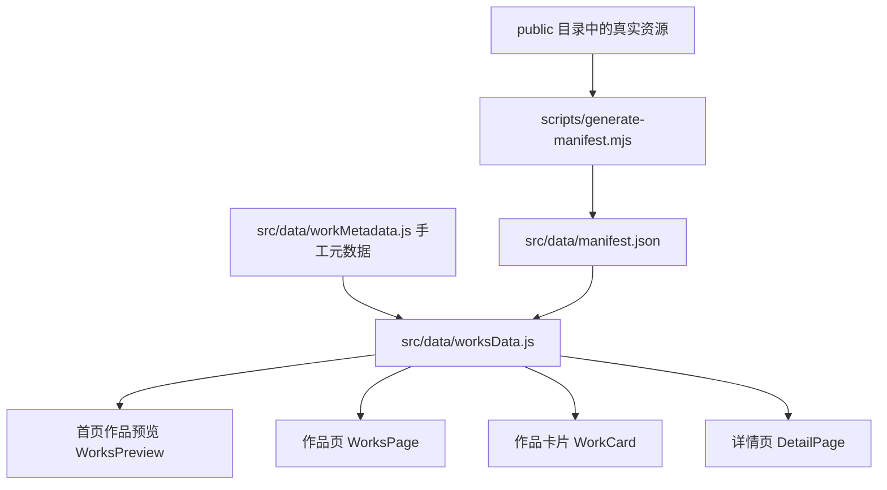

# 新增个人项目标准操作流程

> [!important] 文档目的
> 本文用于规范本个人作品集网站中“新增项目”的完整流程。后续无论是本人手动维护，还是交给其他 AI Agent 继续开发，都应优先阅读本文，再修改项目数据与资源文件。

## 1. 当前作品展示系统总览

本项目不是单纯手写静态 HTML 列表，而是采用以下链路生成作品展示：



核心原则：

1. **真实文件先进入 `public/`**，供 Vite 直接访问。
2. **`scripts/generate-manifest.mjs` 自动扫描文件**，生成 `src/data/manifest.json`。
3. **`src/data/workMetadata.js` 手工登记项目元数据**，包括标题、描述、分类、缩略图、链接、标签等。
4. **`src/data/worksData.js` 合并 manifest 与 metadata**，输出最终展示用数据。
5. **`WorkCard.jsx` 根据项目类型决定行为**：
   - 外部 AI 项目：打开详情弹窗。
   - 本地 HTML 项目：新窗口打开。
   - 本地图片/设计稿：进入详情页展示。
   - 本地视频：详情页使用 `<video>` 播放。

## 2. 相关文件职责表

| 文件或目录 | 职责 | 是否常改 |
|---|---|---|
| `public/img/` | 项目缩略图、截图、SVG 预览图、二维码、Logo | 是 |
| `public/program/` | 可直接打开的 HTML 项目，例如小游戏、仿站页面 | 是 |
| `public/video/` | 视频作品文件，例如 `.mp4`、`.webm` | 是 |
| `public/art/` | 平面设计原始文件或导出图，可递归扫描 | 视情况 |
| `public/modeling/` | 三维建模源文件、压缩包、渲染图 | 视情况 |
| `public/AIGC/` | AIGC 工作流、文档、相关素材 | 视情况 |
| `scripts/generate-manifest.mjs` | 自动扫描 `public/` 并生成文件清单 | 少改 |
| `src/data/manifest.json` | 自动生成的文件清单，不建议手改 | 否 |
| `src/data/workMetadata.js` | 项目元数据注册表，新增项目主要改这里 | 是 |
| `src/data/worksData.js` | 数据合并引擎，控制自动过滤与自动发现逻辑 | 少改 |
| `src/config/siteConfig.js` | 首页分类入口、GitHub 链接、About、技能条等站点配置 | 视情况 |
| `src/components/works/WorkCard.jsx` | 作品卡片与 AI 项目详情弹窗 | 少改 |
| `src/pages/DetailPage.jsx` | 普通作品详情页，展示图片、视频、外链按钮、相关作品 | 少改 |
| `src/components/works/CategoryNav.jsx` | 作品页分类导航 | 新增大类时改 |
| `src/components/sections/WorksPreview.jsx` | 首页作品分类预览 | 新增大类时可能改 |

## 3. 项目数据字段规范

所有明确要展示的项目，都应优先登记在 `src/data/workMetadata.js` 的 `WORK_METADATA` 数组中。

标准字段如下：

```js
{
  id: 'unique-project-id',
  title: '项目标题',
  description: '项目介绍，建议中文为主，说明定位、功能、技术亮点与当前状态',
  category: 'aiDev',
  subcategory: 'desktop',
  thumbnail: 'img/project-preview.png',
  externalLink: 'https://github.com/xxx/xxx',
  previewUrl: 'https://xxx.github.io/project-homepage/',
  isExternal: true,
  tags: ['React', 'AI Agent', 'Node.js'],
  gallery: ['img/project-1.png', 'img/project-2.png'],
}
```

字段说明：

| 字段 | 必填 | 说明 |
|---|---|---|
| `id` | 是 | 全站唯一，建议使用 `分类-项目名`，例如 `ai-aerie` |
| `title` | 是 | 页面显示标题 |
| `description` | 是 | 卡片和详情弹窗/详情页使用的介绍文案 |
| `category` | 是 | 一级分类，必须存在于 `CATEGORY_STRUCTURE` 中 |
| `subcategory` | 否 | 二级分类，有二级分类的大类建议填写 |
| `thumbnail` | 建议 | 缩略图路径。本站本地资源使用 `img/xxx`、`video/xxx` 等相对路径 |
| `externalLink` | 否 | 项目体验地址、本地 HTML、GitHub 仓库或视频路径 |
| `previewUrl` | 否 | 产品官网、Spotlight 首页、演示页等 |
| `isExternal` | 视情况 | 外部型 AI 项目建议设为 `true`，点击后展示 AI 项目详情弹窗 |
| `tags` | 建议 | 技术标签，AI 项目弹窗会完整展示 |
| `gallery` | 否 | 项目截图数组，当前主要用于 AI 项目弹窗 |

> [!warning] 路径规则
> `public/` 下资源在 metadata 中不要写 `public/` 前缀。例如实际文件是 `public/img/aerie-preview.svg`，metadata 应写 `img/aerie-preview.svg`。

## 4. 当前分类体系

分类定义位于 `src/data/workMetadata.js` 的 `CATEGORY_STRUCTURE`。

当前结构：

```js
export const CATEGORY_STRUCTURE = {
  aiDev: {
    title: '人工智能开发',
    categories: {
      desktop: { title: '桌面应用' },
      webapp: { title: 'Web 应用' },
    },
  },
  graphicDesign: {
    title: '平面设计',
    categories: {
      posterDesign: { title: '海报设计' },
      pageDesign: { title: '页面设计' },
    },
  },
  videoEditing: {
    title: '视频剪辑',
    categories: {
      aigc: { title: 'AIGC' },
    },
  },
  modeling3d: {
    title: '三维建模',
  },
  basicLogic: {
    title: '基础逻辑书写',
  },
}
```

新增一级分类时，需要同步检查：

1. `src/data/workMetadata.js` 的 `CATEGORY_STRUCTURE`。
2. `src/config/siteConfig.js` 的 `SITE_CONFIG.workCategories`，用于首页分类预览。
3. `src/components/works/CategoryNav.jsx` 的 `CATEGORIES`，用于作品页分类导航。
4. 如需新图标，从 `lucide-react` 引入矢量图标，不允许使用 emoji 作为图标。

## 5. 新增项目方式一：外部 GitHub 仓库 + 产品主页

适用场景：

- 项目主体在 GitHub 仓库。
- 有独立产品主页、GitHub Pages、Spotlight、部署地址。
- 典型示例：`Aerie · 云栖`。

### 操作步骤

#### 5.1 准备展示素材

将缩略图放入：

```text
public/img/project-name-preview.png
```

也可以使用 `.svg`：

```text
public/img/aerie-preview.svg
```

如有更多截图，统一放入：

```text
public/img/project-name-screen-1.png
public/img/project-name-screen-2.png
public/img/project-name-screen-3.png
```

#### 5.2 登记元数据

在 `src/data/workMetadata.js` 的 `WORK_METADATA` 数组中添加：

```js
{
  id: 'ai-aerie',
  title: 'Aerie · 云栖',
  description: '本地优先的 AI 桌面伴侣，包含项目定位、核心能力、技术架构、当前平台状态等。',
  category: 'aiDev',
  subcategory: 'desktop',
  thumbnail: 'img/aerie-preview.svg',
  previewUrl: 'https://laser1209.github.io/Aerie_Spotlight/',
  externalLink: 'https://github.com/Laser1209/Aerie-Yunqi',
  isExternal: true,
  tags: ['Electron', 'Python', 'AI Agent', 'LLM', '桌面应用'],
}
```

如同时有 Android 原生版本，可在 `description` 中说明，并在 `tags` 中加入：

```js
tags: ['Electron', 'Python', 'Android', 'AI Agent', 'LLM']
```

如需要展示第二个仓库链接，目前 `WorkCard.jsx` 只默认展示 `previewUrl` 与 `externalLink` 两个按钮。若需要单独展示 Android 仓库，可选择：

1. 将 Android 仓库写入 `description`。
2. 扩展字段，例如 `extraLinks`。
3. 修改 `WorkCard.jsx` 的弹窗按钮区域，循环渲染 `extraLinks`。

建议后续如频繁出现多链接项目，统一采用：

```js
extraLinks: [
  { label: 'Android 仓库', url: 'https://github.com/Laser1209/Aerie-Android' },
]
```

并在 `WorkCard.jsx` 中支持该字段。

#### 5.3 生成 manifest 并验证

执行：

```bash
npm run manifest
npm run build
```

验证点：

- 首页人工智能开发分类中出现该项目。
- 作品页 `人工智能` 分类中出现该项目。
- 点击卡片后出现详情弹窗，而不是直接跳走。
- 弹窗内显示缩略图、描述、技术标签、访问主页、GitHub 按钮。

## 6. 新增项目方式二：本地外部项目文件夹接入

适用场景：

- 项目目前不在本作品集目录内。
- 项目位于其他本地目录，例如：

```text
D:\Frontend Learning\Code Set\黑客松\泉客松lyz
```

- 需要先阅读项目内部资料，再总结成作品集展示内容。
- 典型示例：`Braintoss · 不累吐`。

### 操作步骤

#### 6.1 审计本地项目

需要优先查看：

1. `README.md` 或项目说明文档。
2. `package.json`、`pom.xml`、`build.gradle`、`requirements.txt` 等技术栈文件。
3. `src/`、`app/`、`server/`、`backend/`、`frontend/` 等核心源码目录。
4. `docs/`、`assets/`、`screenshots/`、`public/` 中的展示素材。
5. 如果是比赛或黑客松项目，检查答辩 PPT、演示视频、需求文档。

审计后需要整理：

- 项目定位。
- 用户痛点。
- 核心功能。
- 技术架构。
- AI 能力使用方式。
- 当前完成度。
- 可公开展示的截图。
- 是否存在可访问链接或仓库链接。

#### 6.2 复制展示素材到作品集

不要直接引用外部磁盘路径。应将展示用资源复制到本项目的 `public/img/` 中，例如：

```text
public/img/braintoss-mimo.png
public/img/braintoss-mobile-home.png
public/img/braintoss-mobile-mindmap.png
public/img/braintoss-current.png
```

> [!warning] 禁止写入绝对磁盘路径
> metadata 中不要写 `D:\...`。浏览器无法稳定访问本地绝对路径，也不利于部署。

#### 6.3 登记元数据

```js
{
  id: 'ai-braintoss',
  title: 'Braintoss · 不累吐',
  description: '面向知识工作者的 AI 灵感陪伴工具，说明灵感投喂、AI 梳理、思维导图、AI 灵宠、导出能力、会员体系、前后端架构等。',
  category: 'aiDev',
  subcategory: 'webapp',
  thumbnail: 'img/braintoss-mimo.png',
  previewUrl: '',
  externalLink: '',
  isExternal: true,
  tags: ['AI Agent', 'Node.js', 'Express', 'MySQL', 'Spring Boot', '全栈'],
  gallery: [
    'img/braintoss-mobile-home.png',
    'img/braintoss-mobile-mindmap.png',
    'img/braintoss-current.png',
  ],
}
```

如果后续有线上主页或仓库地址，补充：

```js
previewUrl: 'https://example.com',
externalLink: 'https://github.com/Laser1209/project-repo',
```

#### 6.4 验证

执行：

```bash
npm run manifest
npm run build
```

验证点：

- 缩略图正常显示。
- 点击卡片出现详情弹窗。
- 截图库正常显示。
- 没有引用外部磁盘绝对路径。
- 搜索项目标题、技术标签、描述关键词时能被找到。

## 7. 新增项目方式三：本项目内已有静态 HTML 项目

适用场景：

- 项目是一个可直接打开的 `.html` 页面。
- 例如小游戏、仿站页面、单页交互 Demo。
- 当前示例：`program/snake.html`、`program/gobang.html`、`program/qq-music.html`。

### 操作步骤

#### 7.1 放置 HTML 项目

主入口放到：

```text
public/program/project-name.html
```

如果该 HTML 依赖图片、字体、样式：

```text
public/program/img/...
public/program/font/...
public/program/style.css
```

注意：`generate-manifest.mjs` 目前只扫描 `public/program/` 顶层 `.html`，不会把子目录 HTML 当成作品入口。

#### 7.2 准备缩略图

放到：

```text
public/img/project-name-preview.svg
```

或：

```text
public/img/project-name-preview.png
```

#### 7.3 登记元数据

```js
{
  id: 'game-7',
  title: '新小游戏',
  description: '一句话说明游戏玩法或技术亮点',
  category: 'basicLogic',
  thumbnail: 'img/project-name-preview.svg',
  externalLink: 'program/project-name.html',
}
```

如果是页面设计类项目：

```js
{
  id: 'page-2',
  title: '新页面设计',
  description: '页面设计说明',
  category: 'graphicDesign',
  subcategory: 'pageDesign',
  thumbnail: 'img/project-name-preview.png',
  externalLink: 'program/project-name.html',
}
```

#### 7.4 展示行为

`WorkCard.jsx` 会识别 `externalLink` 是否以 `.html` 结尾：

- 卡片角标显示 `Playable`。
- 点击卡片会 `window.open(work.externalLink, '_blank')` 新窗口打开。

## 8. 新增项目方式四：本项目内已有图片、PDF 或设计稿

适用场景：

- 平面海报。
- 页面视觉稿。
- PDF 设计稿。
- 单张渲染图。

### 操作步骤

#### 8.1 放入展示资源

推荐缩略图放在：

```text
public/img/design-name.png
```

原始设计稿可放在：

```text
public/art/design-name.psd
public/art/design-name.pdf
```

当前 `manifest.images` 支持：

```text
.png .jpg .jpeg .svg .webp .gif .pdf
```

#### 8.2 登记元数据

```js
{
  id: 'poster-10',
  title: '新海报作品',
  description: '海报主题与设计风格说明',
  category: 'graphicDesign',
  subcategory: 'posterDesign',
  thumbnail: 'img/design-name.png',
}
```

如果 thumbnail 是 PDF：

```js
thumbnail: 'img/design-name.pdf'
```

> [!note] PDF 显示注意
> 当前详情页使用 `` 展示 `thumbnail`。部分浏览器对 PDF 作为 `img` 的兼容性不稳定。重要作品建议同时导出 PNG/JPG 作为缩略图。

#### 8.3 展示行为

无 `externalLink` 且有 `thumbnail` 时：

- 点击卡片进入 `/works/:id` 详情页。
- `DetailPage.jsx` 使用图片区域展示该作品。

## 9. 新增项目方式五：视频作品

适用场景：

- `.mp4`、`.webm`、`.mov`、`.avi` 视频。
- AIGC 短片、宣传片、剪辑作品。

### 操作步骤

#### 9.1 放置视频

```text
public/video/project-video.mp4
```

#### 9.2 准备缩略图或工作流图

```text
public/img/project-video-cover.png
```

#### 9.3 登记元数据

```js
{
  id: 'aigc-3',
  title: '新 AIGC 短片',
  description: '视频主题、风格与制作方式说明',
  category: 'videoEditing',
  subcategory: 'aigc',
  thumbnail: 'img/project-video-cover.png',
  externalLink: 'video/project-video.mp4',
}
```

#### 9.4 展示行为

`DetailPage.jsx` 会识别 `externalLink` 是否以 `.mp4` 结尾：

- 详情页显示 `<video controls>`。
- 卡片角标显示 `Video`。

## 10. 自动发现机制说明

自动发现由 `src/data/worksData.js` 完成，主要分两类：

1. `public/program/*.html` 中未登记的 HTML，会自动生成作品。
2. `public/video/*` 中未登记的视频，会自动生成作品。

自动生成的数据通常只有：

```js
{
  title: '由文件名生成',
  description: '自动发现的作品',
  category: 'basicLogic 或 videoEditing',
  autoDiscovered: true,
}
```

> [!danger] 自动发现只适合作为兜底，不适合作为正式发布方式
> 正式作品必须在 `workMetadata.js` 中登记元数据。否则标题、描述、分类、缩略图都可能不准确，甚至出现误检测项目。

### 避免误检测的方法

如果某些旧文件不希望展示：

1. 删除 `public/program/` 或 `public/video/` 中对应入口文件。
2. 或修改 `worksData.js` 的自动发现过滤逻辑。
3. 或将非作品文件移出扫描目录。

此前误检测的海报类图片已通过删除资源与 metadata 条目的方式处理。

## 11. 新增一级大类 SOP

如果新增大类，例如“人工智能开发”，需要执行以下步骤：

### 11.1 修改分类结构

文件：`src/data/workMetadata.js`

```js
export const CATEGORY_STRUCTURE = {
  newCategory: {
    title: '新分类名称',
    categories: {
      subType: { title: '子分类名称' },
    },
  },
  // 其他分类...
}
```

分类顺序由对象顺序决定。要置顶，就放在最前面。

### 11.2 修改首页分类入口

文件：`src/config/siteConfig.js`

```js
workCategories: [
  { id: 'newCategory', title: '新分类名称', subtitle: '副标题', icon: 'brain' },
]
```

### 11.3 修改作品页分类导航

文件：`src/components/works/CategoryNav.jsx`

从 `lucide-react` 引入图标：

```js
import { Brain } from 'lucide-react'
```

添加导航项：

```js
{ id: 'newCategory', label: '新分类', Icon: Brain }
```

> [!warning] 图标规范
> 不允许使用 emoji 作为图标。统一使用 `lucide-react` 或其他明确引入的矢量图标库。

### 11.4 检查首页预览组件

文件：`src/components/sections/WorksPreview.jsx`

如果新增的 `icon` 字段无法显示，需要补充 icon 映射。

## 12. 文案编写规范

项目介绍建议使用中文为主，并包含以下结构：

1. **一句话定位**：这个项目是什么。
2. **用户价值**：解决什么问题。
3. **核心功能**：列出 3 到 6 个核心能力。
4. **技术架构**：前端、后端、AI、数据库、客户端等。
5. **当前状态**：已上线、开发中、移动端同步开发中等。
6. **个人贡献**：主导、参与、独立开发、负责视觉/前端/后端/AI 架构等。

示例：

```text
本地优先的 AI 桌面伴侣，面向长期陪伴、任务协助与主动关怀场景。项目基于 Electron + Python 架构，接入多模型 Provider，支持情感引擎、灵动岛 UI、QQ Bot、文件整理与电脑操控等能力。目前桌面端已形成可展示版本，Android 原生端同步开发中。
```

## 13. 缩略图与截图规范

推荐规格：

| 类型 | 推荐比例 | 推荐格式 | 放置位置 |
|---|---|---|---|
| 普通作品缩略图 | 4:3 | `.png` / `.jpg` / `.svg` | `public/img/` |
| AI 项目主图 | 16:10 或 16:9 | `.png` / `.svg` | `public/img/` |
| 移动端截图 | 9:16 | `.png` / `.jpg` | `public/img/` |
| 视频封面 | 16:9 | `.png` / `.jpg` | `public/img/` |
| PDF 作品 | 建议额外导出 PNG | `.pdf` + `.png` | `public/img/` 或 `public/art/` |

命名规则：

```text
项目名-preview.png
项目名-cover.png
项目名-screen-1.png
项目名-mobile-home.png
```

建议使用英文或拼音命名，避免部署环境对中文文件名处理不一致。但已有中文文件名可以保留。

## 14. 验收清单

每次新增项目后，必须检查：

- [ ] 资源文件已放入 `public/` 下合适目录。
- [ ] `workMetadata.js` 已登记项目。
- [ ] `id` 全站唯一。
- [ ] `category` 与 `subcategory` 存在于 `CATEGORY_STRUCTURE`。
- [ ] `thumbnail` 路径不带 `public/` 前缀。
- [ ] 外部项目已设置 `isExternal: true`。
- [ ] 本地 HTML 项目 `externalLink` 指向 `program/xxx.html`。
- [ ] 视频项目 `externalLink` 指向 `video/xxx.mp4`。
- [ ] 已执行 `npm run manifest`。
- [ ] 已执行 `npm run build`。
- [ ] 首页分类预览显示正常。
- [ ] 作品页分类导航显示正常。
- [ ] 搜索能搜到项目标题或关键词。
- [ ] 点击卡片后的行为符合预期。
- [ ] 控制台无资源 404、模块导入错误或 React 报错。

## 15. 常见问题与处理

### 15.1 图片不显示

检查：

1. 文件是否在 `public/img/`。
2. metadata 是否写成 `img/xxx.png`，而不是 `public/img/xxx.png`。
3. 文件名大小写和空格是否完全一致。
4. 是否执行过 `npm run manifest`。
5. 是否被 CSS 滤镜影响，例如 `brightness-0 invert`。

### 15.2 项目没有出现

检查：

1. `workMetadata.js` 是否保存。
2. `category` 是否拼写正确。
3. `thumbnail` 或 `externalLink` 是否至少有一个能被 manifest 识别。
4. 外部链接项目是否设置了 `isExternal: true`。
5. `npm run manifest` 是否生成了最新 `manifest.json`。

### 15.3 出现不该展示的项目

原因通常是自动发现扫描到了旧 HTML 或视频。

处理：

1. 删除误检测文件。
2. 或移出 `public/program/` / `public/video/`。
3. 或在 `worksData.js` 的自动发现逻辑中加入排除规则。

### 15.4 外部 AI 项目点击后直接跳转，而不是弹窗

检查：

```js
isExternal: true
```

`WorkCard.jsx` 只有在 `work.isExternal` 为真时，才打开详情弹窗。

### 15.5 多个项目链接需要展示

当前结构只内置：

- `previewUrl`：访问主页按钮。
- `externalLink`：GitHub 或外部链接按钮。

如果项目有多个仓库或多个端，可以扩展：

```js
extraLinks: [
  { label: 'Android 仓库', url: 'https://github.com/Laser1209/Aerie-Android' },
  { label: '产品主页', url: 'https://laser1209.github.io/Aerie_Spotlight/' },
]
```

然后修改 `WorkCard.jsx` 的弹窗按钮区域，渲染 `extraLinks`。

## 16. 推荐执行顺序

新增一个项目时，建议按以下顺序执行：

1. 阅读项目源资料，明确项目定位和展示重点。
2. 整理截图、缩略图、视频或 HTML 入口。
3. 将展示资源复制到 `public/` 合适目录。
4. 在 `workMetadata.js` 添加项目元数据。
5. 如需新增分类，同步修改分类结构、首页分类入口、作品页导航。
6. 执行 `npm run manifest`。
7. 执行 `npm run build`。
8. 启动或刷新页面，检查首页、作品页、详情弹窗/详情页。
9. 检查控制台与网络请求。
10. 若项目与 AI 对话知识库相关，同步更新 `src/data/aiPrompt.js`。

## 17. AI Agent 接手提示词

如果后续交给其他 AI Agent 新增项目，可以直接给它以下指令：

```text
请先阅读 Documents/project-creation-standard-process.md，严格按照其中的 SOP 为当前个人作品集新增项目。新增前先审计项目资料和展示资源；新增时优先修改 src/data/workMetadata.js，必要时复制资源到 public/img、public/program、public/video 等目录；新增后执行 npm run manifest 和 npm run build，并检查首页、作品页、卡片点击行为、详情弹窗/详情页是否正常。
```

## 18. 当前项目接入示例索引

| 项目 | 类型 | 数据位置 | 展示方式 |
|---|---|---|---|
| Aerie · 云栖 | 外部 GitHub + 产品主页 | `workMetadata.js` 中 `ai-aerie` | AI 项目弹窗，含主页/GitHub |
| Braintoss · 不累吐 | 本地外部项目整理后接入 | `workMetadata.js` 中 `ai-braintoss` | AI 项目弹窗，含截图 gallery |
| QQ音乐 | 本地 HTML 页面 | `program/qq-music.html` + `page-1` metadata | 新窗口打开 HTML |
| 贪吃蛇/五子棋/扫雷等 | 本地 HTML 游戏 | `program/*.html` + `game-*` metadata | 新窗口打开 HTML |
| Each Rich | 视频作品 | `video/Each_Rich.mp4` + `aigc-1` metadata | 详情页视频播放 |
| 斯卡蒂 | 三维建模展示 | `img/skadi-render.png` + `3d-1` metadata | 详情页图片展示 |

---

最后维护原则：**正式作品一定登记 metadata，自动发现只做兜底；展示资源必须进入 `public/`；新增分类必须同步导航和首页入口；构建通过才算交付完成。**
